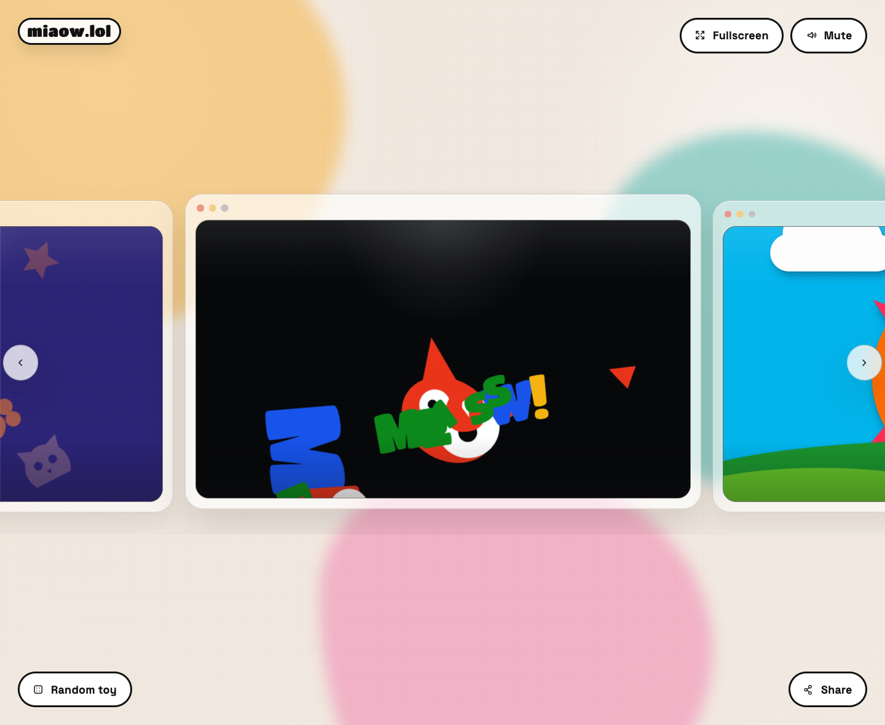

# miaow.lol

miaow.lol is a pile of cat browser toys for the web. Some are noisy, some are soft, some are just weird little interaction experiments.

Play it at [miaow.lol](https://miaow.lol).



This project was inspired by [tinyfingers.net](https://tinyfingers.net/).

## Running locally

```bash
npm install
npm run dev
```

Vite will print the local URL.

## Tests

```bash
npm test
```

## Cloudflare Workers

This repo deploys as a Worker with static assets behind the `ASSETS` binding. The Worker layer keeps home and shared toy URLs crawlable by injecting the right SEO and social metadata at the edge, and it serves `robots.txt` plus `sitemap.xml`.

```bash
npm run cf:check
npm run cf:deploy
```

For local Worker runs, copy `.dev.vars.example` to `.dev.vars` if you want to pin canonical URLs:

```bash
cp .dev.vars.example .dev.vars
npm run build
npx wrangler dev
```

Keep Cloudflare-specific identifiers and credentials out of the repository. Do not commit account IDs, zone IDs, route patterns, API tokens, or private bindings; set those in the Cloudflare dashboard or CI instead.

## Project layout

- `src/App.jsx` holds the app shell, history handling, and the switch between the lobby and the active toy.
- `src/data/experiences.js` is the catalog of toys, including titles, descriptions, themes, and lazy imports.
- `src/data/experienceCatalog.js` is the Worker-safe toy catalog used for edge SEO and sitemap generation.
- `src/toys/` contains the toy implementations.
- `src/components/` contains the lobby, player, share UI, and supporting pieces.
- `src/share.js` builds share URLs and payloads for each toy.
- `src/seo.js` updates the page title, meta description, and canonical URL.
- `worker/index.js` injects SEO/share metadata for `?experience=...` requests and serves crawler-friendly text endpoints.
- `src/html/` contains preview HTML used by individual toys.
- `audio/` contains the sound assets.

## Adding a toy

1. Add the toy component in `src/toys/`.
2. Add its metadata and loader in `src/data/experiences.js`.
3. Add preview HTML in `src/html/` if the toy needs it.
4. Run `npm test`.
